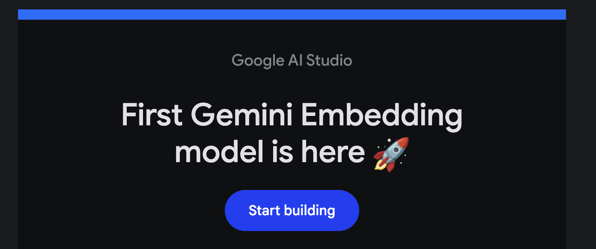

# SimplyCodes AI Shopping Partner

A privacy-first browser extension that uses local AI to find and apply the best coupon codes while you shop online.

## 🚀 Features

- **Local AI Processing**: All ML inference runs directly in your browser using WebGPU
- **Privacy-First**: No personal data or browsing history leaves your device
- **Smart Coupon Ranking**: AI-powered ranking finds the best deals based on success rates and savings
- **Natural Language Chat**: Ask questions about products and deals in plain English
- **One-Click Application**: Automatically apply the best coupon code at checkout
- **Community-Verified**: Coupons backed by community trust scores
- **AI Recommendations**: Get smart tips like "Add $10 more for free shipping!"
- **Savings Dashboard**: Track total saved, streaks, and personal best savings
- **Gamification**: Unlock achievements and compete on the global leaderboard
- **Expiry Alerts**: Never miss time-sensitive flash sales

## 📋 Requirements

- Chrome or Edge browser (version 110+)
- WebGPU support (falls back to WASM if unavailable)
- ~1GB free space for AI models

## 🛠️ Installation

### For Users

1. Download the latest release from the releases page
2. Open Chrome/Edge and navigate to `chrome://extensions`
3. Enable "Developer mode" 
4. Click "Load unpacked" and select the `dist` folder
5. The SimplyCodes icon will appear in your browser toolbar

### For Developers

```bash
# Clone the repository
git clone https://github.com/yourusername/simplycodes
cd simplycodes

# Install dependencies
pnpm install

# Build all packages
pnpm build

# Run in development mode
pnpm dev

# Run tests
pnpm test
pnpm test:e2e
```

## 🏗️ Architecture

```
┌─────────────────┐     ┌──────────────────┐     ┌─────────────────┐
│  Content Script │────▶│  Service Worker  │────▶│   ONNX Runtime  │
│  (UI Injection) │     │  (Background)    │     │   (WebGPU/WASM) │
└─────────────────┘     └──────────────────┘     └─────────────────┘
         │                       │                          │
         ▼                       ▼                          ▼
┌─────────────────┐     ┌──────────────────┐     ┌─────────────────┐
│  React Sidebar  │     │   Mock Data API  │     │   ML Models     │
│  (Popup + Chat) │     │  (Local JSON)    │     │  (ONNX Format)  │
└─────────────────┘     └──────────────────┘     └─────────────────┘
```

### Key Components

- **Extension** (`packages/extension`): Chrome extension with React UI
- **Web-LLM** (`packages/web-llm`): ONNX Runtime wrapper for in-browser ML
- **Mock Data** (`packages/shared-mock-data`): Sample datasets for demo
- **Types** (`packages/types`): Shared TypeScript definitions

## 🤖 AI Models

The extension uses two AI models:

1. **TinyLlama 1.1B** (Q5 quantization): For natural language chat
2. **XGBoost Ranker**: For coupon scoring and ranking

Models are loaded progressively and cached in browser storage.

## 🔒 Privacy

SimplyCodes is designed with privacy as the top priority:

- ✅ All AI processing happens locally in your browser
- ✅ No personal data is sent to external servers
- ✅ Only anonymized merchant hashes are used for coupon lookups
- ✅ No tracking or analytics
- ✅ Open source and auditable

See [PRIVACY.md](docs/PRIVACY.md) for details.

## 📸 Screenshots

<div align="center">
  
  
  
  
</div>

## 📱 Usage

1. **Browse** to any supported e-commerce site
2. **Click** the SimplyCodes icon when you see it light up
3. **View** available coupons ranked by AI
4. **Apply** the best deal with one click or browse all options
5. **Chat** with the AI assistant for product questions

### Supported Sites

- Amazon
- Best Buy
- Target
- Walmart
- eBay
- Home Depot
- Lowe's
- Wayfair

## 🧪 Development

### Project Structure

```
simplycodes/
├── packages/
│   ├── extension/        # Browser extension
│   ├── web-llm/         # ML runtime wrapper  
│   ├── shared-mock-data/ # Mock datasets
│   └── types/           # TypeScript types
├── tests/               # Test suites
├── docs/               # Documentation
└── scripts/            # Build scripts
```

### Testing

```bash
# Unit tests
pnpm test

# E2E tests (requires built extension)
pnpm build
pnpm test:e2e

# Type checking
pnpm typecheck

# Linting
pnpm lint
```

### Building

```bash
# Development build
pnpm dev

# Production build
pnpm build

# Build specific package
pnpm --filter @simplycodes/extension build
```

## 📊 Performance

- Extension load time: <150ms
- Model loading: ~5-10s (first time only)
- Inference latency: <100ms for ranking, <500ms for chat
- Memory usage: ~500MB when models loaded

## 🤝 Contributing

Contributions are welcome! Please read our contributing guidelines and code of conduct.

## 📄 License

MIT License - see [LICENSE](LICENSE) file for details

## 🙏 Acknowledgments

- ONNX Runtime team for WebGPU support
- TinyLlama community for the efficient language model
- All contributors and testers

---

**Note**: This is a demonstration prototype showcasing local AI capabilities in browser extensions. Model files need to be downloaded separately.