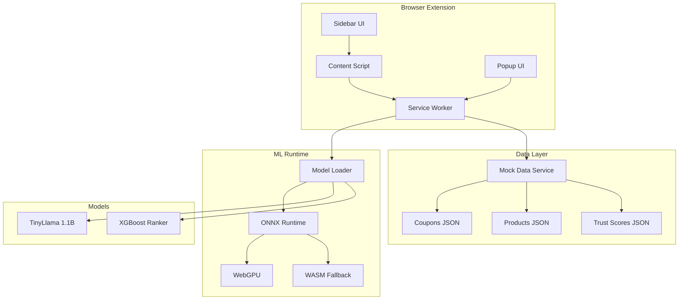

# SimplyCodes Architecture

## System Overview

SimplyCodes is a privacy-first browser extension that leverages WebGPU and ONNX Runtime to run ML models directly in the browser.



## Component Architecture

### 1. Extension Layer

#### Content Script (`content/index.ts`)
- Injects UI elements into supported e-commerce sites
- Detects checkout pages and pricing information
- Communicates with service worker via Chrome messaging API
- Manages sidebar iframe lifecycle

#### Service Worker (`background/service-worker.ts`)
- Central message hub for all extension components
- Manages ML model loading and inference
- Handles coupon retrieval and ranking
- Maintains extension state

#### Popup UI (`popup/`)
- Quick access to coupons for current site
- "Apply Best Deal" one-click functionality
- Statistics and settings access
- Built with React + TailwindCSS

#### Sidebar UI (`sidebar/`)
- Full-featured coupon browser
- AI chat interface
- Real-time model status updates
- Embedded as iframe for isolation

### 2. ML Runtime Layer

#### Model Loader (`web-llm/model-loader.ts`)
- Progressive model downloading with progress tracking
- Caching and memory management
- WebGPU detection and fallback logic
- Session lifecycle management

#### LLM Inference (`web-llm/llm-inference.ts`)
- Token generation with streaming support
- Temperature and sampling controls
- KV cache management for efficiency
- Simple tokenizer implementation

#### Coupon Ranker (`web-llm/coupon-ranker.ts`)
- Feature extraction from coupon metadata
- XGBoost inference for scoring
- Confidence-based filtering
- Real-time ranking based on cart total

### 3. Data Layer

#### Mock Data Service (`shared-mock-data/`)
- Simulates API responses with local JSON
- Privacy-preserving merchant hashing
- Fuzzy product search with Fuse.js
- Community trust score integration

## Data Flow

### Coupon Retrieval Flow

```
1. User visits supported site
   ↓
2. Content script detects domain
   ↓
3. Sends merchant hash to service worker
   ↓
4. Service worker queries mock data
   ↓
5. Coupons filtered by merchant
   ↓
6. ML ranker scores coupons (if cart total available)
   ↓
7. Ranked results sent to UI
```

### Chat Interaction Flow

```
1. User types message in sidebar
   ↓
2. Message sent to service worker
   ↓
3. Service worker invokes LLM inference
   ↓
4. Tokens generated with local context
   ↓
5. Response streamed back to UI
   ↓
6. UI updates with citations
```

## Security Architecture

### Content Security Policy
```javascript
{
  "content_security_policy": {
    "extension_pages": "script-src 'self' 'wasm-unsafe-eval'; object-src 'self'"
  }
}
```

### Permission Model
- **activeTab**: Only access current tab when user clicks
- **storage**: Save user preferences locally
- **scripting**: Inject content script on supported sites
- **clipboardWrite**: Copy coupon codes

### Isolation Boundaries
1. **Process Isolation**: Service worker runs in separate process
2. **Origin Isolation**: Sidebar runs in extension origin
3. **Frame Isolation**: Iframe sandbox for sidebar
4. **Memory Isolation**: WebGPU memory management

## Performance Optimizations

### Model Loading
- Chunked downloading for progress feedback
- Compression with ONNX quantization
- Lazy loading based on user interaction
- Persistent caching in IndexedDB

### Inference Optimization
- WebGPU acceleration when available
- Batch processing for multiple coupons
- KV cache for chat continuity
- Early stopping for token generation

### UI Responsiveness
- React concurrent features
- Virtual scrolling for long lists
- Debounced search inputs
- Skeleton loading states

## Scalability Considerations

### Horizontal Scaling
- Stateless service worker design
- Independent tab contexts
- Parallel model inference
- Distributed caching

### Vertical Scaling
- Progressive model quality (Q4 → Q5 → Q8)
- Adaptive batch sizes
- Dynamic memory allocation
- Graceful degradation

## Monitoring & Debugging

### Development Tools
```javascript
// Enable debug logging
localStorage.setItem('SIMPLYCODES_DEBUG', 'true');

// Performance profiling
performance.mark('model-load-start');
// ... loading ...
performance.mark('model-load-end');
performance.measure('model-load', 'model-load-start', 'model-load-end');
```

### Error Boundaries
- React error boundaries in UI components
- Try-catch blocks in service worker
- Graceful WebGPU fallback
- User-friendly error messages

## Future Architecture Considerations

### Potential Enhancements
1. **WebRTC DataChannel**: P2P coupon sharing
2. **Service Worker Modules**: Code splitting
3. **Web Workers**: Offload tokenization
4. **SharedArrayBuffer**: Faster model loading
5. **WebTransport**: Real-time updates

### Scaling Challenges
1. **Model Size**: Balance quality vs download time
2. **Memory Usage**: Manage multiple model variants
3. **Battery Impact**: Optimize for mobile devices
4. **Network Conditions**: Handle slow connections

## Technology Stack

### Frontend
- **React 18**: UI components with concurrent features
- **TailwindCSS**: Utility-first styling
- **Zustand**: Lightweight state management
- **Vite**: Fast build tooling

### ML/AI
- **ONNX Runtime Web**: Cross-platform inference
- **WebGPU**: GPU acceleration
- **TinyLlama**: Efficient language model
- **XGBoost**: Gradient boosting for ranking

### Infrastructure
- **pnpm**: Efficient monorepo management
- **TypeScript**: Type safety across packages
- **Jest**: Unit testing framework
- **Cypress**: E2E testing automation

## Deployment Architecture

### Build Pipeline
```bash
pnpm build
├── TypeScript compilation
├── React bundling
├── TailwindCSS optimization
├── ONNX model optimization
└── Extension packaging
```

### Distribution
- Chrome Web Store (primary)
- Edge Add-ons Store
- GitHub releases (sideload)
- Auto-update mechanism

## Conclusion

SimplyCodes demonstrates that privacy-preserving AI is not only possible but practical in production browser extensions. The architecture prioritizes user privacy while delivering a responsive, feature-rich experience through careful system design and modern web technologies.